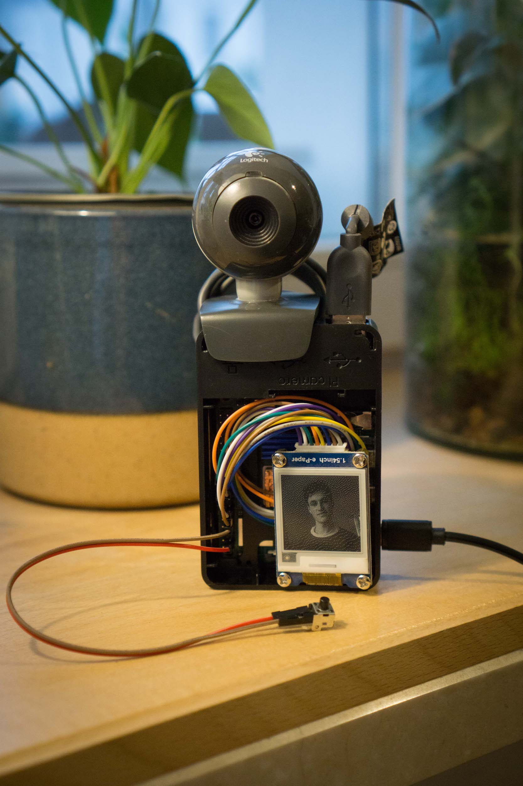
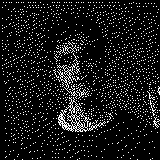
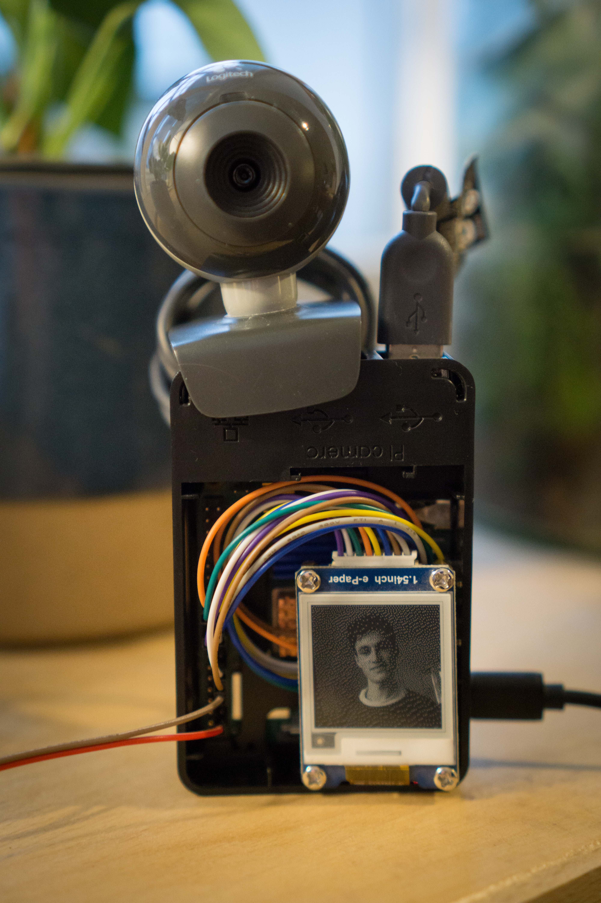

# ePaper Polaroid
**Instant pictures with a Raspberry Pi, a webcam and an ePaper display:**

The boredom of a winter saturday was spent building this diy instant photography style device. By pressing the button, the webcam takes a picture, which is then cropped, resized and converted to black and white to be shown on the ePaper display. 

# Image processing
Here is an example of a captured webcam image and the images after each processing step. First, the original image from the webcam:

  
This is cropped to a square.

  
Then the image is resized to the display resolution of 200x200 pixels.

  
And the last step is to convert this image to a binary, black and white image.

 
And then visible on the display:

# Code
There is very little code, all of which relies on great python libraries. Button presses are detected with the builtin Raspberry Pi GPIO library[^1](see [button.py](src/button.py)). Capturing images from the webcam is done with openCV[^2](see [capture.py](src/capture.py)). The image is then saved as a jpeg file and loaded with the Pillow image processing library and processed, as seen above. Then it is sent to the display over the SPI connection (see [display.py](src/display.py)). 

The Raspberry Pi is run with a full Raspberry Pi OS image (headless image makes installing openCV harder because of the missing multimedia libraries) and the script [ePaper_polaroid.py](src/ePaper_polaroid.py) is started on every reboot via cron (<https://phoenixnap.com/kb/crontab-reboot>).

# Hardware
 - Raspberry Pi 4B
 - Logitech C200
 - Waveshare 1.54 inch e-Paper (<https://www.waveshare.com/wiki/1.54inch_e-Paper_Module>)
 - Pushbutton

[^1]: <https://raspberrypihq.com/use-a-push-button-with-raspberry-pi-gpio/>
[^2]: <https://www.jeremymorgan.com/tutorials/raspberry-pi/how-to-install-opencv-raspberry-pi/>
